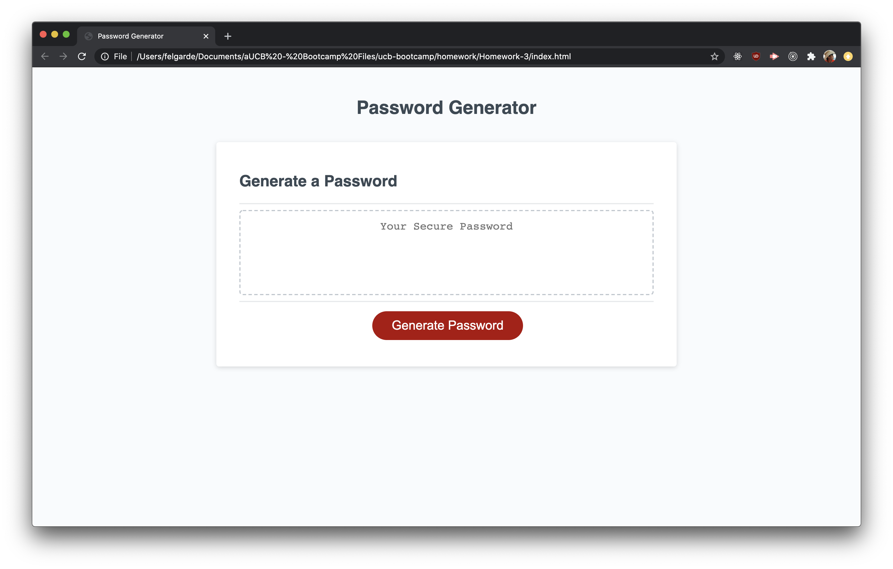
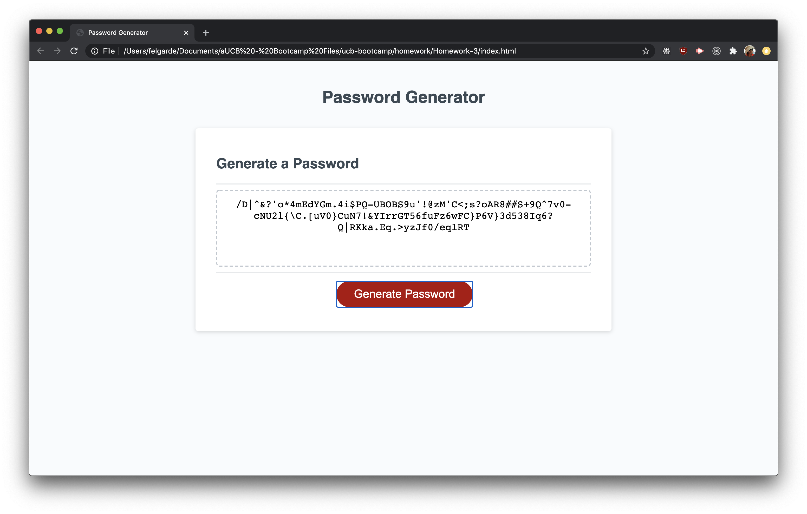
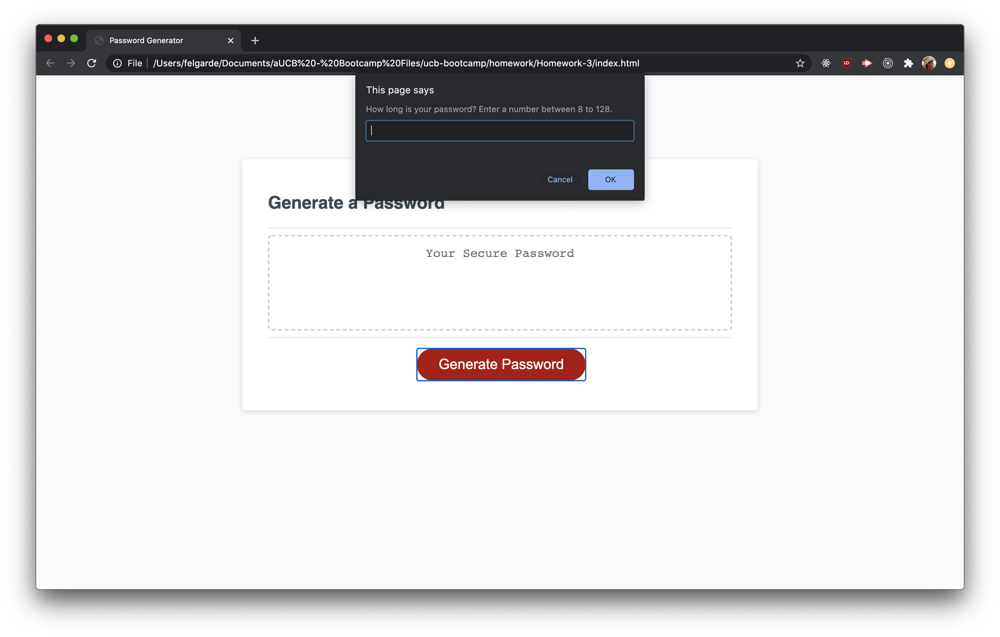

This repository is a week 3 homework submission for UCB Bootcamp

The homework task is to create a password generator that follows the user's requirements

Below are screenshots of the homework from the project

This link goes to the live version of the homework.

[Live homework](https://berjonbatistiana.github.io/Homework-3/)

